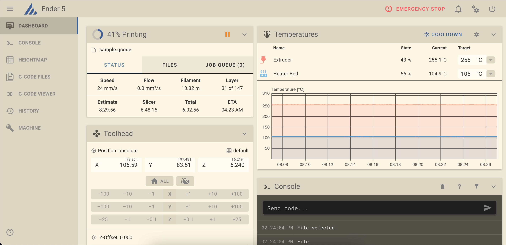
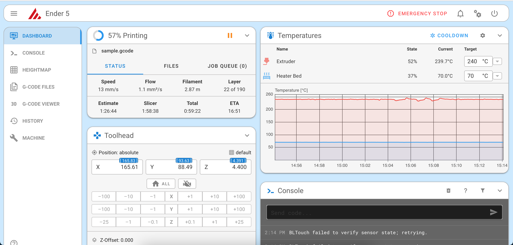

# Mainsail Light Themes

Here are a couple of light themes for Mainsail.

## Solarized Light

## Blue Theme

## Installation
Copy everything in .theme directory. example `printer_data/config/.theme`. For the solarized light theme, I have logo and primary set to R:62, G: 95, B: 150 in the UI settings.
